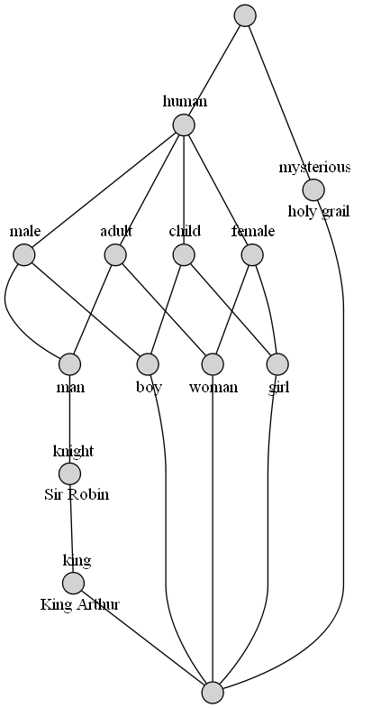

.. _advanced:

Advanced Usage
==============

Modification
------------

:class:`.Context` objects are **immutable**. However, iterative assembling,
modification, and combination of contexts is supported by using
:class:`.Definition` objects. They can be edited and then given to
:class:`.Context` to construct a new context object:

.. code:: python

    >>> from concepts import Definition, Context

    >>> d = Definition()

    >>> d.add_object('man', ['male'])
    >>> d.add_object('woman', ['female'])

    >>> d
    <Definition(['man', 'woman'], ['male', 'female'], [(True, False), (False, True)])>

    >>> d.add_property('adult', ['man', 'woman'])
    >>> d.add_property('child', ['boy', 'girl'])

    >>> print(d)
         |male|female|adult|child|
    man  |X   |      |X    |     |
    woman|    |X     |X    |     |
    boy  |    |      |     |X    |
    girl |    |      |     |X    |

    >>> d['boy', 'male'] = True
    >>> d.add_object('girl', ['female'])

    >>> print(Context(*d))  # doctest: +ELLIPSIS
    <Context object mapping 4 objects to 4 properties at 0x...>
             |male|female|adult|child|
        man  |X   |      |X    |     |
        woman|    |X     |X    |     |
        boy  |X   |      |     |X    |
        girl |    |X     |     |X    |

Use definitions to combine two contexts, fill out the missing cells, and create
the resulting context:

.. code:: python

    >>> c = Context.fromstring('''
    ...            |human|knight|king |mysterious|
    ... King Arthur|  X  |  X   |  X  |          |
    ... Sir Robin  |  X  |  X   |     |          |
    ... holy grail |     |      |     |     X    |
    ... ''')

    >>> h = Context.fromstring('''
    ...      |male|female|adult|child|
    ... man  |  X |      |  X  |     |
    ... woman|    |   X  |  X  |     |
    ... boy  |  X |      |     |  X  |
    ... girl |    |   X  |     |  X  |
    ... ''')

    >>> u = c.definition() | h.definition()

    >>> print(u)
               |human|knight|king|mysterious|male|female|adult|child|
    King Arthur|X    |X     |X   |          |    |      |     |     |
    Sir Robin  |X    |X     |    |          |    |      |     |     |
    holy grail |     |      |    |X         |    |      |     |     |
    man        |     |      |    |          |X   |      |X    |     |
    woman      |     |      |    |          |    |X     |X    |     |
    boy        |     |      |    |          |X   |      |     |X    |
    girl       |     |      |    |          |    |X     |     |X    |

    >>> u.add_property('human', ['man', 'woman', 'boy', 'girl'])
    >>> u.add_object('King Arthur', ['male', 'adult'])
    >>> u.add_object('Sir Robin', ['male', 'adult'])

    >>> print(u)
               |human|knight|king|mysterious|male|female|adult|child|
    King Arthur|X    |X     |X   |          |X   |      |X    |     |
    Sir Robin  |X    |X     |    |          |X   |      |X    |     |
    holy grail |     |      |    |X         |    |      |     |     |
    man        |X    |      |    |          |X   |      |X    |     |
    woman      |X    |      |    |          |    |X     |X    |     |
    boy        |X    |      |    |          |X   |      |     |X    |
    girl       |X    |      |    |          |    |X     |     |X    |

    >>> Context(*u).lattice  # doctest: +ELLIPSIS
    <Lattice object of 5 atoms 14 concepts 2 coatoms at 0x...>

