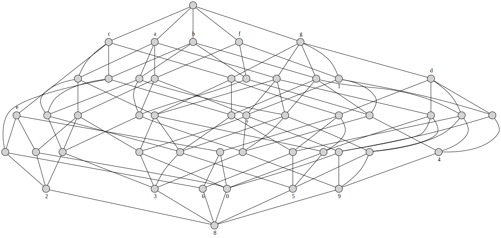
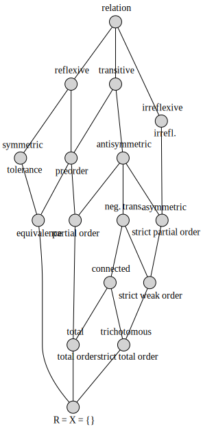

.. _examples:

Examples
========

See the ``examples`` directory in the `source repository/distribution`__.

.. __: http://github.com/xflr6/concepts/tree/master/examples/

digits.cxt
----------

.. literalinclude:: ../examples/digits.cxt

.. code:: python

    from concepts import Context
    
    d = Context.fromfile('examples/digits.cxt')
    
    d.lattice.graphviz(view=True)

relations.csv
-------------

.. literalinclude:: ../examples/relations.csv

.. code:: python

    from concepts import Context
    
    r = Context.fromfile('examples/relations.csv', frmat='csv')
    
    r.lattice.graphviz(view=True)

