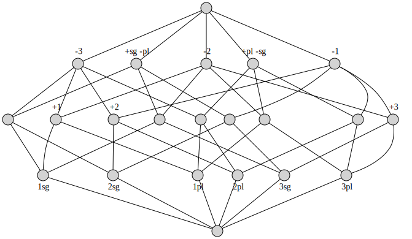

.. _examples:

Examples
========

These and more examples files are included in the ``examples/`` directory of the
`source repository/distribution`__.

.. __: https://github.com/xflr6/concepts/tree/master/examples/

digits.cxt
----------

.. literalinclude:: ../examples/digits.cxt
    :linenos:

.. code:: python

    import concepts
    
    digits = concepts.Context.fromfile('examples/digits.cxt')
    
    digits.lattice.graphviz(view=True)

.. image:: _static/digits.svg
    :align: center

relations.csv
-------------

.. literalinclude:: ../examples/relations.csv
    :linenos:

.. code:: python

    import concepts
    
    relations = concepts.Context.fromfile('examples/relations.csv', frmat='csv')
    
    relations.lattice.graphviz(view=True)

.. image:: _static/relations.svg
    :align: center

example.json
------------

.. literalinclude:: ../examples/example.json
    :linenos:

.. code:: python

    import concepts
    
    example = concepts.Context.fromjson('examples/example.json', require_lattice=True)
    
    example.lattice.graphviz(view=True)

