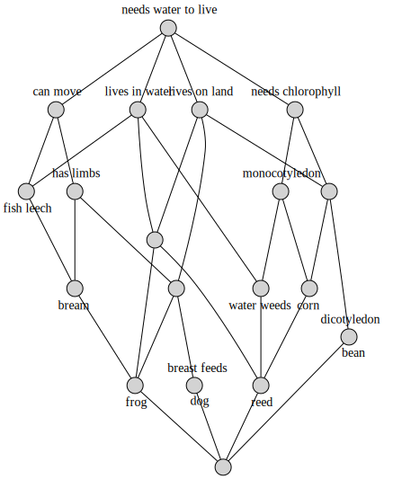
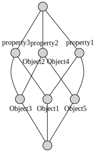
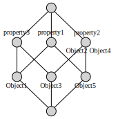
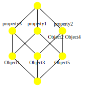
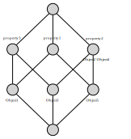
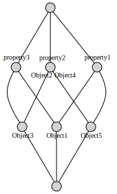

.. _manual:

User Guide
==========

Installation
------------

:mod:`concepts` is a pure-python package that runs under Python 3.10+.
It is `available from PyPI`_. To install it with pip_, run the following
command:

.. code:: bash

    $ pip install concepts

For a system-wide install, this typically requires administrator access. For an
isolated installation, you can run the same inside a :mod:`py:venv` or a 
virtualenv_

The pip-command will automatically install the (pure-Python) bitsets_ and
graphviz_ packages from PyPI as required dependencies.

To render graph visualizations (to PDF, SVG, PNG, etc.) of concept lattices,
you also need to have a working installation of the `Graphviz software`_
(`download page`_).

After installing Graphviz, make sure that its ``bin/`` subdirectory containing
the layout commands for rendering graph descriptions (``dot``, ``circo``,
``neato``, etc.) is on your systems' path: On the command-line, ``dot -V``
should print the version of your Graphiz installation.

Formal contexts
---------------

With :mod:`concepts`, formal contexts (:class:`.Context` objects) can be
created from a string with an ASCII-art style **cross-table**.
The :attr:`~.Context.objects` and :attr:`~.Context.properties` will simply be
represented by strings.
Separate the property columns with *pipe* symbols (``'|'``), create one row for
each objects, one column for each property, and indicate the presence of a
property with the character ``'X'``.

Note that the object and property names need to be *disjoint* to uniquely
identify them.

.. code:: python

    >>> import concepts

    >>> context = concepts.Context.fromstring('''
    ...            |human|knight|king |mysterious|
    ... King Arthur|  X  |  X   |  X  |          |
    ... Sir Robin  |  X  |  X   |     |          |
    ... holy grail |     |      |     |     X    |
    ... ''')

    >>> context  # doctest: +ELLIPSIS
    <Context object mapping 3 objects to 4 properties [dae7402a] at 0x...>

You can also load contexts from files in different **plain-text formats**, see
below.

After creation, the parsed content of the table is available on the
:class:`.Context` object.

.. code:: python

    >>> context.objects  # row headings
    ('King Arthur', 'Sir Robin', 'holy grail')

    >>> context.properties  # column headings
    ('human', 'knight', 'king', 'mysterious')

    >>> context.bools  # data cells
    [(True, True, True, False), (True, True, False, False), (False, False, False, True)]

The :class:`.Context` object can be queried to return the **common properties**
for a collection of objects (common *intent*, :meth:`~.Context.intension`) as well
as the **common objects** for a collection of properties (common *extent*,
:meth:`~.Context.extension`):

.. code:: python

    >>> context.intension(['King Arthur', 'Sir Robin'])  # common properties?
    ('human', 'knight')

    >>> context.extension(['knight', 'mysterious'])  # objects with these properties?
    ()

In FCA these operations are called *derivations* and usually notated with the
*prime* symbol(').

.. code:: python

    >>> context.extension(['knight', 'king'])
    ('King Arthur',)

    >>> context.extension(['mysterious', 'human'])
    ()

Formal concepts
---------------

A pair of objects and properties such that the objects share exactly the
properties and the properties apply to exactly the objects is called *formal
concept*. Informally, they result from maximal rectangles of ``X``-marks in the
context table, when rows and columns can be reordered freely.

You can retrieve the **closest matching concept** corresponding to a collection
of objects or properties with the :meth:`~.Context.__getitem__` method of the
:class:`.Context` object:

.. code:: python

    >>> context['king',]  # closest concept matching intent/extent
    (('King Arthur',), ('human', 'knight', 'king'))

    >>> assert context.intension(('King Arthur',)) == ('human', 'knight', 'king')
    >>> assert context.extension(('human', 'knight', 'king')) == ('King Arthur',)

    >>> context['King Arthur', 'Sir Robin']
    (('King Arthur', 'Sir Robin'), ('human', 'knight'))

Within each :class:`~.Context`, there is a **maximally general
concept** comprising all of the :attr:`~.Context.objects` as extent and having
an *empty* intent (*supremum*).

.. code:: python

    >>> context['Sir Robin', 'holy grail']  # maximal concept, supremum
    (('King Arthur', 'Sir Robin', 'holy grail'), ())

Furthermore there is a **minimally general concept** comprising no object at all
and having all :attr:`~.Context.properties` as intent (*infimum*).

.. code:: python

    >>> context['mysterious', 'knight']  # minimal concept, infimum
    ((), ('human', 'knight', 'king', 'mysterious'))

The concepts of a context can be ordered by extent set-inclusion (or, dually,
by intent set-inclusion). With this (partial) order, they form a *concept lattice*
(:class:`.Lattice` object) having the :attr:`~.Lattice.supremum` concept (i.e. the tautology) at the top, the :attr:`~.Lattice.infimum`
concept (i.e. the contradiction) at the bottom, and the other concepts in
between.

Concept lattice
---------------

The concept :attr:`~.Context.lattice` of a :class:`.Context` contains **all
pairs of objects and properties** (*formal concepts*) that can be retrieved
from a formal context. You can iterate over the :class:`.Lattice` to
visit all concepts:

.. code:: python

    >>> context  # doctest: +ELLIPSIS
    <Context object mapping 3 objects to 4 properties [dae7402a] at 0x...>
    
    >>> lattice = context.lattice

    >>> lattice  # doctest: +ELLIPSIS
    <Lattice object of 2 atoms 5 concepts 2 coatoms at 0x...>

    >>> for extent, intent in lattice:
    ...     print(extent, intent)
    () ('human', 'knight', 'king', 'mysterious')
    ('King Arthur',) ('human', 'knight', 'king')
    ('holy grail',) ('mysterious',)
    ('King Arthur', 'Sir Robin') ('human', 'knight')
    ('King Arthur', 'Sir Robin', 'holy grail') ()

Individual :class:`~.lattices.Concept` objets can be retrieved from the
:class:`.Lattice` object by different means :

.. code:: python

    >>> lattice.infimum  # first concept, index 0
    <Infimum {} <-> [human knight king mysterious]>

    >>> lattice.supremum  # last concept
    <Supremum {King Arthur, Sir Robin, holy grail} <-> []>

    >>> lattice[1]
    <Atom {King Arthur} <-> [human knight king] <=> King Arthur <=> king>

    >>> lattice['mysterious',]
    <Atom {holy grail} <-> [mysterious] <=> holy grail <=> mysterious>

The concepts form a **directed acyclic graph** and are linked upward (more
general concepts, superconcepts) and downward (less general concepts,
subconcepts):

.. code:: python

    >>> lattice.infimum.upper_neighbors  # doctest: +NORMALIZE_WHITESPACE
    (<Atom {King Arthur} <-> [human knight king] <=> King Arthur <=> king>,
     <Atom {holy grail} <-> [mysterious] <=> holy grail <=> mysterious>)

    >>> lattice[1].lower_neighbors
    (<Infimum {} <-> [human knight king mysterious]>,)

Visualization
-------------

To visualize the :class:`.Lattice`, use its :meth:`~.Lattice.graphviz` method:

.. code:: python

    >>> dot = lattice.graphviz()

    >>> print(dot.source)  # doctest: +ELLIPSIS, +NORMALIZE_WHITESPACE
    // <Lattice object of 2 atoms 5 concepts 2 coatoms at 0x...>
    digraph Lattice {
    	node [label="" shape=circle style=filled width=.25]
    	edge [dir=none labeldistance=1.5 minlen=2]
    		c0
    		c1
    			c1 -> c1 [color=transparent headlabel="King Arthur" labelangle=270]
    			c1 -> c1 [color=transparent labelangle=90 taillabel=king]
    			c1 -> c0
    		c2
    			c2 -> c2 [color=transparent headlabel="holy grail" labelangle=270]
    			c2 -> c2 [color=transparent labelangle=90 taillabel=mysterious]
    			c2 -> c0
    		c3
    			c3 -> c3 [color=transparent headlabel="Sir Robin" labelangle=270]
    			c3 -> c3 [color=transparent labelangle=90 taillabel="human knight"]
    			c3 -> c1
    		c4
    			c4 -> c2
    			c4 -> c3
    }

.. image:: _static/holy-grail.svg
    :align: center

For example:

.. code:: python

    >>> human = concepts.Context.fromstring('''
    ...      |male|female|adult|child|
    ... man  |  X |      |  X  |     |
    ... woman|    |   X  |  X  |     |
    ... boy  |  X |      |     |  X  |
    ... girl |    |   X  |     |  X  |
    ... ''')
    >>> dot = human.lattice.graphviz()

    >>> print(dot.source)  # doctest: +ELLIPSIS, +NORMALIZE_WHITESPACE
    // <Lattice object of 4 atoms 10 concepts 4 coatoms at 0x...>
    digraph Lattice {
    	node [label="" shape=circle style=filled width=.25]
    	edge [dir=none labeldistance=1.5 minlen=2]
    		c0
    		c1
    			c1 -> c1 [color=transparent headlabel=man labelangle=270]
    			c1 -> c0
    		c2
    			c2 -> c2 [color=transparent headlabel=woman labelangle=270]
    			c2 -> c0
    		c3
    			c3 -> c3 [color=transparent headlabel=boy labelangle=270]
    			c3 -> c0
    ...

.. image:: _static/human.svg
    :align: center

A more complex example:

.. code:: python

    >>> water = concepts.Context.fromfile('examples/liveinwater.cxt')
    >>> dot = water.lattice.graphviz()

    >>> print(dot.source)  # doctest: +ELLIPSIS, +NORMALIZE_WHITESPACE
    // <Lattice object of 4 atoms 19 concepts 4 coatoms at 0x...>
    digraph Lattice {
    	node [label="" shape=circle style=filled width=.25]
    	edge [dir=none labeldistance=1.5 minlen=2]
    		c0
    		c1
    			c1 -> c1 [color=transparent headlabel=frog labelangle=270]
    			c1 -> c0
    		c2
    			c2 -> c2 [color=transparent headlabel=dog labelangle=270]
    			c2 -> c2 [color=transparent labelangle=90 taillabel="breast feeds"]
    			c2 -> c0
    		c3
    			c3 -> c3 [color=transparent headlabel=reed labelangle=270]
    			c3 -> c0
    ...

For details on the resulting objects' interface, check the documentation_ of
the `Python graphviz interface`_ used.

Customization
^^^^^^^^^^^^^

The style of the graph can be customized by modifying the ``graph_attr``,
``node_attr`` and ``edge_attr`` dictionaries on the returned object (see also
`Graphviz attributes`_):

.. code:: python

    >>> objects = concepts.Context.fromstring('''
    ...        |property1|property2|property3|
    ... Object1|    X    |         |    X    |
    ... Object2|         |    X    |         |
    ... Object3|         |    X    |    X    |
    ... Object4|         |    X    |         |
    ... Object5|    X    |    X    |         |
    ... ''')
    >>> dot = objects.lattice.graphviz()
    >>> dot
    <graphviz.graphs.Digraph object at 0x...>

.. code:: python

    >>> dot.node_attr = {'shape': 'circle', 'width': '0.2',
    ...                  'style': 'filled', 'label': ''}
    >>> dot.edge_attr = {'dir': 'none', 'labeldistance': '1',
    ...                  'minlen': '1', 'fontsize': '10'}
    >>> dot
    <graphviz.graphs.Digraph object at 0x...>

.. code:: python

    >>> dot.node_attr['color'] = 'yellow'
    >>> dot
    <graphviz.graphs.Digraph object at 0x...>

.. code:: python

    >>> del dot.node_attr['color']
    >>> dot.edge_attr['fontsize'] = '5'
    >>> dot
    <graphviz.graphs.Digraph object at 0x...>

.. code:: python

    >>> dot.edge_attr.update(fontsize='10', minlen='2')
    >>> dot
    <graphviz.graphs.Digraph object at 0x...>

Persistence
-----------

CXT, CXT, table
^^^^^^^^^^^^^^^

:class:`.Context` objects can be loaded from and saved to files and strings in
CXT, CSV and ASCII-art table formats.
For loading, use :meth:`.Context.fromfile` or :meth:`.Context.fromstring`:

.. code:: python

    >>> c1 = concepts.Context.fromfile('examples/liveinwater.cxt')
    >>> c1  # doctest: +ELLIPSIS
    <Context object mapping 8 objects to 9 properties [b1e86589] at 0x...>

    >>> c2 = concepts.Context.fromfile('examples/liveinwater.csv', frmat='csv')
    >>> c2  # doctest: +ELLIPSIS
    <Context object mapping 8 objects to 9 properties [b1e86589] at 0x...>

    >>> c3 = concepts.Context.fromfile('examples/liveinwater.txt', frmat='table')
    >>> c3  # doctest: +ELLIPSIS
    <Context object mapping 8 objects to 9 properties [b1e86589] at 0x...>

    >>> assert c1 == c2 == c3

To save a :class:`.Context` object, use its :meth:`~.Context.tofile` or
:meth:`~.Context.tostring` methods.
All four methods allow to specify the ``frmat`` argument (``'cxt'``, ``'csv'``,
or ``'table'``).

The :func:`.load` function can be used to infer the format from the filename
suffix.
There is also a dedicated :func:`.load_cxt` for loading CXT files, and
:func:`.load_csv` for loading contexts from CSV files in different formats via
the ``dialect`` argument (e.g. ``'excel-tab'`` for tab-separated, see
:mod:`csv` docs).

.. note::

    These methods/functions load/save only the :class:`.Context`, not the
    structure of its :attr:`~.Context.lattice` (i.e. only the information to
    recreate the :class:`.Context`; its :attr:`~.Context.lattice` can be
    recomputed on demand).

Custom :mod:`json`-compatible format
^^^^^^^^^^^^^^^^^^^^^^^^^^^^^^^^^^^^

:class:`.Context` objects can also be serialized and deserialized using a
custom :mod:`json`-based format with :meth:`~.Context.tojson` and 
:meth:`.Context.fromjson`.
This format allows to include the :attr:`~.Context.lattice` structure, so it
can be used for long-term storage of large graphs that are expensive to
compute:

.. code:: python

    >>> context = concepts.Context.fromjson('examples/example.json', encoding='utf-8')
    >>> context
    <Context object mapping 6 objects to 10 properties [b9d20179] at 0x...>

The same custom storage format is also available as plain Python :obj:`dict`,
e.g. to be used with other methods of (de)serialization such as :mod:`pickle`,
:func:`pprint.pprint` + :func:`ast.literal_eval`, yaml_, toml, xml, a database,
etc. Use :meth:`~.Context.todict` and  :meth:`.Context.fromdict`:

.. code:: python

    >>> print(', '.join(sorted(context.todict())))
    context, lattice, objects, properties

See :ref:`json_format` for details.

With :mod:`pickle`
^^^^^^^^^^^^^^^^^^

:class:`.Context` objects are also pickleable:

.. code:: python

    >>> import pickle

    >>> pickle.loads(pickle.dumps(context)) == context
    True

.. _available from PyPI: https://pypi.org/project/concepts/

.. _pip: https://pip.readthedocs.io
.. _virtualenv: https://virtualenv.pypa.io

.. _bitsets: https://pypi.org/project/bitsets/
.. _graphviz: https://pypi.org/project/graphviz/

.. _Graphviz software: http://www.graphviz.org
.. _download page: http://www.graphviz.org/Download.php

.. _documentation: https://graphviz.readthedocs.io
.. _Python graphviz interface: graphviz_
.. _Graphviz attributes: https://www.graphviz.org/doc/info/attrs.html

.. _yaml: https://pyyaml.org